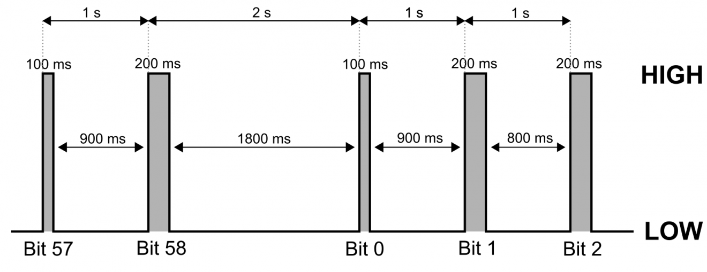
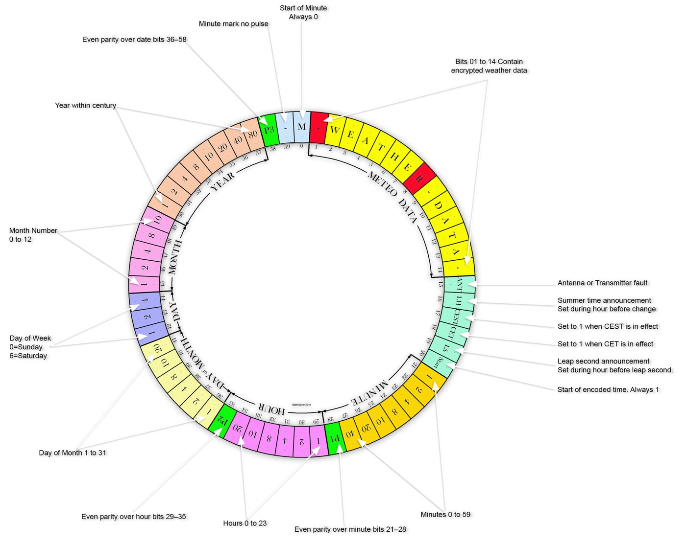

# DCF77 Signal Reception and Decoding

## General Description

`RF_DCF77` is a standalone Python decoder for the DCF77 longwave time signal.
It can run in two modes:

- **Hardware mode (Raspberry Pi):** reads real pulse edges from a DCF77 receiver module connected to a GPIO pin.
- **Simulation mode (PC or Raspberry Pi):** generates a valid DCF77 frame and feeds it through the same processing path used in GPIO mode.

The software decodes minute frames (59 bits), validates parity groups, and prints decoded date/time with timezone flag interpretation (CET/CEST).

## DCF77 Transmission Overview

DCF77 transmits one bit per second and one frame per minute:

- pulse length around **100 ms** -> bit `0`
- pulse length around **200 ms** -> bit `1`
- **missing pulse in second 59** -> minute marker / frame boundary

Fig1. DCF77 signal structure. Image courtesy of Wolfgang Ewald (see [1]).

The decoder expects 59 payload bits (index `0..58`) and validates parity fields:

- `P1` for minutes
- `P2` for hours
- `P3` for date block

Selected bit groups used by the decoder:

- `17..18` timezone flags (CET/CEST)
- `20` start of time information
- `21..27` minutes, `28` parity P1
- `29..34` hours, `35` parity P2
- `36..57` date block, `58` parity P3

Fig2. DCF77 Bit specification, Image courtesy of brettoliver.org.uk (see [2])

## Decoder Software Design Overview

### Layered Architecture

The program is organized into 3 logical layers:

1. **Acquisition Layer**
   - Gets pulse edges from GPIO callback (`_edge_callback`) in hardware mode.
   - In simulation mode, synthetic pulses are generated and passed into the same processing function.

2. **Frame Assembly Layer**
   - Converts pulse duration into bit (`_process_pulse`).
   - Appends bits to frame buffer (`DCF77Decoder.add_bit`).
   - Detects minute marker by inter-pulse gap and closes frame (`_finalize_frame`).

3. **Decode/Validation Layer**
   - Validates frame structure and parity (`DCF77Decoder.decode`).
   - Decodes BCD fields (minute, hour, date).
   - Returns structured result and prints final decoded time.

### Major Functions/Classes

- `DCF77Decoder`
  - `add_bit(bit)` -> append bit to current frame
  - `is_complete()` -> check whether frame has 59 bits
  - `decode()` -> parity checks + BCD decode + datetime construction

- `DCF77GPIOReceiver`
  - `setup()` / `cleanup()` -> GPIO lifecycle
  - `_edge_callback()` -> pulse edge handling
  - `_process_pulse()` -> pulse-to-bit conversion and logging
  - `_finalize_frame()` -> frame boundary handling and decode trigger
  - `run()` -> main receive loop with signal handling

- Simulation helpers
  - `build_simulated_frame(dt)` -> builds valid DCF77 frame for given datetime
  - `run_simulation(args)` -> replays synthetic pulses through normal processing path

- CLI and entrypoint
  - `parse_args(argv)` -> command line parsing
  - `main(argv)` -> switches between GPIO and simulation mode

### Information Flow

`Pulse source (GPIO or simulation)` -> `_process_pulse` -> `decoder bit buffer` -> `minute marker` -> `decode()` -> `validated datetime output`

---

## System Requirements

### Simulation Mode

In this mode, decoder can be started on the PC with no additional hardware required.

- Windows 11
- Python 3.9+

### Hardware Mode (Raspberry Pi)

- Raspberry Pi with Raspberry Pi OS
- Python 3.9+
- DCF77 receiver hardware module connected to GPIO (in this project RC8000 module is used)
- `RPi.GPIO` library

GPIO library has to be installed on Pi hardware:

`sudo apt update`
`sudo apt install -y python3-rpi.gpio`

## How to Run the Decoder

Decoder can be started in either simulation or hardware mode.

### Simulation Mode (PC Based Testing)

During development and testing, the decoder can be run in simulation mode on the PC with python3 installed. No additional hardware is needed in this mode.

Decoder can be started using below command:

`python dcf77_gpio.py --simulate --simulate-datetime 2026-02-16T12:34`

In this mode, the decoder generates a test bitstream using the date and time provided via `--simulate-datetime` (in this example: `2026-02-16T12:34`) and then decodes it as if it were received from a real DCF77 signal.

### Hardware Mode (Raspberry Pi)

After moving to the target Raspberry Pi environment start the decoder with:

`python dcf77_gpio.py --pin 25 --active-high`

Complete list of available command options:

- `--pin <int>`  
  GPIO pin number in BCM numbering mode (default: `17`).  
  **Example:** `python dcf77_gpio.py --pin 17`

- `--active-high`  
  Treat receiver pulses as active-high (default behavior is active-low).  
  **Example:** `python dcf77_gpio.py --active-high`

 - `--min-pulse-ms`  
  Ignore spikes shorter than the minimum duration (in milliseconds) before bit decoding (default: `50 ms`).  
  **Example:** `python dcf77_gpio.py --min-pulse-ms 30`

- `--zero-threshold-ms <float>`  
  Pulse width threshold (ms) for decoding bit `0` vs bit `1` (default: `150`).  
  **Example:** `python dcf77_gpio.py --zero-threshold-ms 145`

- `--marker-gap-s <float>`  
  Gap length (s) recognized as minute marker / missing 59th pulse (default: `1.5`).  
  **Example:** `python dcf77_gpio.py --marker-gap-s 1.6`

- `--simulate`  
  Run in simulation mode (no GPIO / `RPi.GPIO` required).  
  **Example:** `python dcf77_gpio.py --simulate`

- `--simulate-datetime <YYYY-MM-DDTHH:MM>`  
  Date/time used to generate a simulated DCF77 frame (default: `2026-01-15T12:34`).  
  **Example:** `python dcf77_gpio.py --simulate --simulate-datetime 2026-02-16T12:34`

- `--simulate-speed <float>`  
  Simulation speed multiplier (`20` = 20x faster than real time, default: `20.0`).  
  **Example:** `python dcf77_gpio.py --simulate --simulate-speed 100`

### Stopping the Decoder

The decoding process can be interrupted at any time by pressing:

`Ctrl + C`

This safely stops the program and returns to the shell.

### Processing Decoder Output

To limit the decoder output to only successfully decoded timestamps (which are also written to a text file), you can use the following workflow with two terminal windows:

Terminal 1:

`python dcf77_gpio.py | grep "Decoded DCF77 time:" | tee -a decoded.txt`

Terminal 2:

`tail -n 10 -f decoded.txt`

This setup filters the decoder output to show only valid timestamps, saves them to decoded.txt, and continuously displays the most recent 10 entries.

# References

[1] DCF77 – Radio Controlled Clock by Wolfgang Ewald, https://wolles-elektronikkiste.de/en/dcf77-radio-controlled-clock

[2] DCF77 Analyzer, https://www.brettoliver.org.uk/DCF77_ESP32_Analyzer/ESP32_DCF77_Analyzer.htm